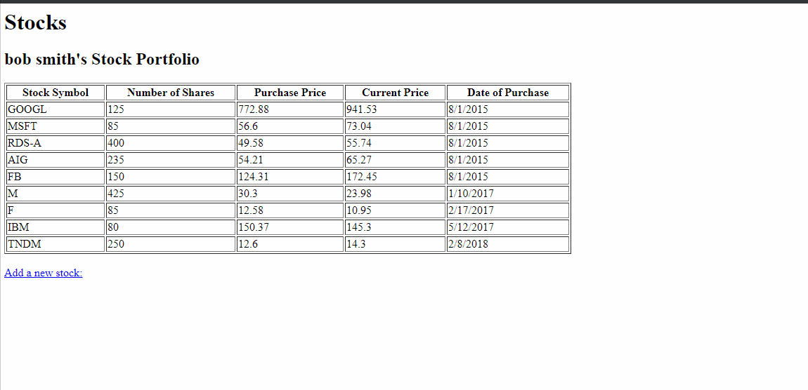

# Stock Portfolio Web App

A Django web app that displays a list of stock information for an investor. The investor can add additional stock and its information to the stock portfolio.

**Usage**

```
git clone https://github.com/sumittamrakar/Stock-Portfolio-Web-App.git
```
*1. Activate the virtual environment.*
```
cd \stocks_venv\Scripts
> activate
```
*2. Start the web server.*
```
cd \stock_project
> python ../manage.py runserver
```
*3. Go to http://127.0.0.1:8000/*

*4. To add a new stock.*
- Click on "Add a new stock:" button.
- Add stock information.
- Select "Add Stock" button.
- Observe the new stock in the stock portfolio.

**Here is a demo for the stock portfolio web app:**

